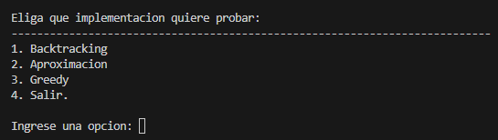
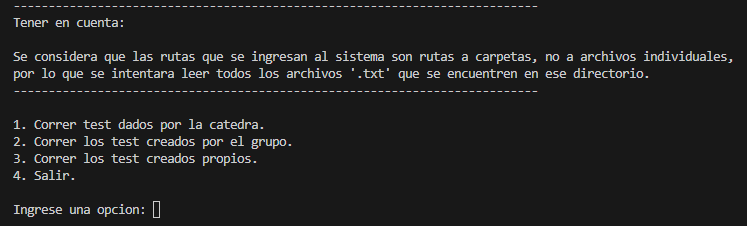

# TP3 grupal de TDA
## Instrucciones para correr el sistema

### Correr el sistema
Para correrel sistema ejecute el main.
```bash
...\TP-TDA\TP3> python main.py
```

Una vez ejecutado el main se mostrara un menu con las siguientes opciones:


Se debe elegir la implementacion que se quiere probar. Luego se mostrara las siguientes opciones:


### 1. Correr los test proporcionados por la catedra
Para correr los test ingrese 1. El resultado de los test se encuentra en `./out/output.txt`.

### 2. Correr los test creados por el grupo
Para correr los test ingrese 2. El resultado de los test se encuentra en `./out/output.txt`.

### 3. Correr los test creados por mí
Para correr los test creados por usted, ingrese 3. Luego, se le pedira una ruta absoluta al directorio donde se encuentran los test.

#### Requisitos de los archivos de test

El sistema tiene la capacidad de ejecutar más de un test a la vez, por lo que para la ruta absoluta se espera que sea un directorio, NO un archivo. Luego el sistema leerá todos los archivos `.txt` que se encuentran en el directorio. Estos archivos deben cumplir con los siguientes formatos: 

1. los archivos con los test deben ser `.txt`
2. Se espera recibir tres sets.
3. El primer set debe corresponder a las demandas de las filas.
3. El segundo set debe corresponder a las demandas de las columnas.
3. El tercer set debe corresponder a laslongitudes de los barcos.
4. Los sets se deben separar con una linea vacia.
5. Cada elemento del set debe escribirse en una linea distinta. Cada linea debe contener como maximo un numero.
6. Cualquier otra linea que no sea la que contenga dichos valores debe comenzar con '#'.

Ejemplo:
```bash
3
1
2

3
2
0

1
1
```
### Resultado de los test
El resultado de este test se encuentra en el directorio out/ dentro del proyecto.
Para guardar estos resultados cambiarle el nombre al archivo de salida.
De lo contrario se sobreescribira.
